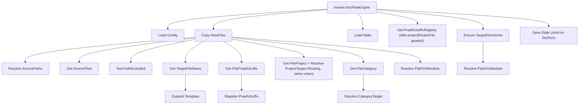

# DocFlowEngine.psm1 – Modul-Referenz

Diese Seite dokumentiert das PowerShell-Modul [`scripts/DocFlowEngine.psm1`](../scripts/DocFlowEngine.psm1) selbst: welche Funktionen es enthält, wie sie zusammenhängen und welche externen Abhängigkeiten benötigt werden. Sie ergänzt [`Configuration.md`](Configuration.md) (Konfigurationsformat) und [`Logging.md`](Logging.md) (Log-Verhalten) um die Code-Perspektive.

## Einordnung im Projekt

```
scripts/DocFlowEngine.ps1   → dünner Wrapper, importiert das Modul und ruft Invoke-DocFlowEngine auf
scripts/DocFlowEngine.psm1  → enthält die gesamte Logik (diese Datei)
config/docflow-config.psd1  → wird von Load-Config gelesen
config/project-routes.txt   → Registry, wird von Get-PraefixSuffixRegistry gelesen/erweitert
.docflow-state.json         → wird von Load-State / Save-State verwaltet
docflow.log                 → wird von Write-Log beschrieben
```

`Invoke-DocFlowEngine` ist der einzige Einstiegspunkt, den `DocFlowEngine.ps1` aufruft. Alle anderen Funktionen sind Bausteine, die von dort (oder voneinander) aufgerufen werden.

## Aufbau der Datei (von oben nach unten)

So liest sich `DocFlowEngine.psm1`, wenn man die Datei einmal durchscrollt – nur die wichtigsten Blöcke, nicht jede einzelne Funktion (Details siehe [Funktionsreferenz](#funktionsreferenz) weiter unten):

- **`#Requires -Version 5.1`** (Zeile 1) – erzwingt einen klaren Fehler beim Start, falls eine ältere PowerShell-Version verwendet wird, statt eines kryptischen Parser-Fehlers weiter unten.
- **`Write-Log`** (Zeile 3) – weil praktisch jede andere Funktion sie zur Diagnose aufruft. Schreibt Konsolen- und optional Logdatei-Ausgaben.
- **`Expand-Template`** (Zeile 33) – kleiner Platzhalter-Ersetzer (`{key}` → Wert), den die Umbenennungslogik weiter unten braucht.
- **Pfad-Helfer** `Resolve-PathOrAbsolute`, `Resolve-SourcePaths`, `Test-PathExcluded` (Zeile 48–144) – sorgen dafür, dass Pfade aus der Konfiguration (inkl. Wildcards, auch wenn der Zielpfad noch nicht existiert) zuverlässig aufgelöst und bereits sortierte Dateien beim Scannen übersprungen werden.
- **Kompatibilitäts-Helfer** `ConvertTo-DocFlowHashtable`, `Get-DocFlowRelativePath` (Zeile 146–185) – kapseln alles, was zwischen PowerShell 7 und Windows PowerShell 5.1 unterschiedlich ist (`ConvertFrom-Json -AsHashtable`-Ersatz, `GetRelativePath`-Ersatz).
- **`Load-Config`** (Zeile 187) – liest und validiert `docflow-config.psd1`. Hier brechen fehlerhafte Konfigurationen mit `throw` ab.
- **`Load-State` / `Save-State`** (Zeile 235–268) – Lesen/Schreiben der `.docflow-state.json`, damit bereits kopierte Dateien nicht doppelt verarbeitet werden.
- **`Ensure-TargetDirectories`** (Zeile 270) – legt fehlende Zielordner an, bevor irgendetwas kopiert wird.
- **`Get-SourceFiles`** (Zeile 295) – sammelt die tatsächlichen Dateien aus einem Quellordner anhand der `includePatterns` und entfernt anschließend Treffer, die auf `excludePatterns` passen.
- **`Get-TargetFileName`** (Zeile 331) – die eigentliche Umbenennungslogik: testet die `namingConventions`-Regeln und bildet den neuen Dateinamen.
- **Routing-Helfer** `Get-FileCategory`, `Get-FileProject`, `Get-FilePraefixSuffix`, `Write-NamingConventionHint` & zugehörige `Resolve-*`/Registry-Funktionen (Zeile 381–610) – ermitteln, in welches Zielverzeichnis eine Datei einsortiert wird, wenn `categoryRoutes` bzw. `aufgabenRoot` konfiguriert sind, bzw. legen einen Hinweis an, wenn `aufgabenRoot` gesetzt ist, die Datei aber keiner Praefix/Suffix-Regel entspricht.
- **`Copy-NewFiles`** (Zeile 612) – die zentrale „Arbeitsfunktion“: bündelt alle obigen Bausteine pro Datei (Name bilden, Ziel bestimmen, kopieren, Zustand aktualisieren).
- **`Invoke-DocFlowEngine`** (Zeile 732) – der Einstiegspunkt, den `DocFlowEngine.ps1` aufruft; lädt Konfiguration/Zustand, ruft `Copy-NewFiles` auf und speichert am Ende den Zustand.
- **`Export-ModuleMember`** (Zeile 802) – letzte Zeile der Datei; macht alle Funktionen nach außen sichtbar (siehe [Exportierte Funktionen](#exportierte-funktionen)).

## Externe Abhängigkeiten

Das Modul läuft sowohl unter PowerShell 7+ als auch unter Windows PowerShell 5.1 – ohne Admin-Rechte, ohne Zusatzmodule und ohne den `??`-Operator, `ConvertFrom-Json -AsHashtable` oder `[System.IO.Path]::GetRelativePath` vorauszusetzen (dafür gibt es die Kompatibilitäts-Helfer oben). Die Konfiguration liegt als PowerShell-Data-Datei (`.psd1`) vor und wird mit dem seit PowerShell 5.0 eingebauten `Import-PowerShellDataFile` gelesen – kein YAML-Parser, kein externes Modul nötig.

| Abhängigkeit | Wird verwendet von | Hinweis |
|---|---|---|
| `Import-PowerShellDataFile` | `Load-Config` | Eingebautes Cmdlet seit PowerShell 5.0 (Windows PowerShell 5.1 und PowerShell 7+), kein Zusatzmodul nötig |
| `ConvertFrom-Json` + `ConvertTo-DocFlowHashtable` | `Load-State` | Eigene rekursive Konvertierung statt `-AsHashtable` (PS6+-only), funktioniert daher auch unter Windows PowerShell 5.1 |
| .NET `System.IO.Path` / `System.IO.FileInfo` | `Get-TargetFileName`, `Resolve-PathOrAbsolute`, `Copy-NewFiles` | Pfad- und Dateinamensoperationen; relative Pfade laufen über `Get-DocFlowRelativePath` (`Uri.MakeRelativeUri`), da `Path.GetRelativePath` unter .NET Framework/PS5.1 fehlt |
| .NET `System.Collections.Generic.HashSet` | `Get-PraefixSuffixRegistry`, `Register-PraefixSuffix` | Case-insensitive Duplikatsprüfung über `StringComparer.OrdinalIgnoreCase` |
| Standard-Cmdlets | überall | `Get-Content`, `Add-Content`, `Set-Content`, `Test-Path`, `Resolve-Path`, `Get-ChildItem`, `Copy-Item`, `New-Item`, `Split-Path`, `Join-Path`, `Get-Date` |

Es gibt keine externe Modul-Abhängigkeit mehr – alles läuft mit Bordmitteln von PowerShell 5.1/7+.

## Versteckte Abhängigkeit: Script-Scope-Variablen

Mehrere Funktionen verlassen sich auf `$Script:`-Variablen, die **von `Invoke-DocFlowEngine` zu Beginn gesetzt werden**. Das ist beim Verständnis des Codes wichtig, weil es nicht aus den Funktionssignaturen hervorgeht:

| Variable | Gesetzt von | Gelesen von |
|---|---|---|
| `$Script:LogLevels` | `Invoke-DocFlowEngine` (auch lazy in `Write-Log`, falls noch nicht gesetzt) | `Write-Log` |
| `$Script:CurrentLogLevel` | `Invoke-DocFlowEngine` (Default: `Info`, falls nicht gesetzt) | `Write-Log` |
| `$Script:LogFilePath` | `Invoke-DocFlowEngine` | `Write-Log` |
| `$Script:DryRun` | `Invoke-DocFlowEngine` (`-DryRun`-Switch) | `Ensure-TargetDirectories`, `Register-PraefixSuffix`, `Copy-NewFiles` |

Ruft man einzelne Funktionen (z. B. in Tests) isoliert auf, ohne vorher `Invoke-DocFlowEngine` laufen zu lassen, greifen sinnvolle Defaults (Log-Level `Info`, kein DryRun) – es kommt also zu keinem Fehler, aber das Verhalten kann von einem vollständigen Lauf abweichen.

## Ablauf von `Invoke-DocFlowEngine`



Schritt für Schritt:

1. **Konfiguration laden** – `Load-Config` liest und validiert `docflow-config.psd1`.
2. **Zielordner vorbereiten** – `Ensure-TargetDirectories` legt fehlende `targets`-Ordner an (oder loggt dies im DryRun).
3. **Zustand laden** – `Load-State` liest `.docflow-state.json` (bereits verarbeitete Dateien).
4. **Registry laden** – falls `projectRoutesFile` konfiguriert ist, liest `Get-PraefixSuffixRegistry` bekannte Präfixe/Suffixe ein.
5. **Dateien verarbeiten** – `Copy-NewFiles` ist die zentrale Funktion: sie iteriert über alle `sources`, ermittelt neue Dateien, bildet Zielnamen, bestimmt das passende Zielverzeichnis (siehe Routing-Priorität unten) und kopiert.
6. **Zustand speichern** – `Save-State` schreibt die aktualisierte `.docflow-state.json` (außer im DryRun).

## Routing-Priorität in `Copy-NewFiles`

Für jede neue Datei wird das Zielverzeichnis in dieser Reihenfolge bestimmt – die erste zutreffende Regel gewinnt:

1. **`aufgabenRoot` + Präfix/Suffix** – greift, wenn `Get-FilePraefixSuffix` aus dem Dateinamen `praefix`/`suffix` extrahieren kann → Ziel: `<aufgabenRoot>/<Präfix>/<Suffix>/`.
   - Ist `aufgabenRoot` konfiguriert, `Get-FilePraefixSuffix` liefert aber `$null` (Datei entspricht nicht dem Schema) **und** `namingConventionHint.enabled` ist `$true` (Standard): Die Datei wird **nicht** kopiert. Stattdessen legt `Write-NamingConventionHint` im Quellordner der Datei eine Hinweis-Textdatei an (falls dort noch keine existiert) und die Datei wird übersprungen (`continue`) – sie erscheint dadurch in keinem der folgenden Schritte.
2. **`ProjectRoutes`** – greift, wenn `Get-FileProject` eine `project`-Gruppe liefert und diese in den Projekt-Routen vorkommt.
3. **`CategoryRoutes`** – greift, wenn `Get-FileCategory` einen führenden Kategorie-Namen liefert, der zu einer konfigurierten `categoryRoutes`-Regel passt.
4. **Fallback: `targets`** – falls keines der obigen Routings aktiv ist.

> **Hinweis (aktueller Code-Stand):** `ProjectRoutes` (Schritt 2) wird in `Invoke-DocFlowEngine` nicht befüllt – es gibt keinen Aufruf von `Get-ProjectRoutes`, und `Copy-NewFiles` erhält kein `-ProjectRoutes`-Argument. `Get-ProjectRoutes`/`Resolve-ProjectTarget`/`Get-FileProject` sind als Funktionen vorhanden und exportiert (z. B. für Tests oder zukünftige Erweiterung), greifen im Hauptablauf aber aktuell nicht. Aktiv genutzt werden nur das Präfix/Suffix-Routing (`aufgabenRoot`) und `categoryRoutes`.

## Funktionsreferenz

### Logging & Templates

**`Write-Log -Level <Trace|Debug|Info|Warning|Error> -Message <string>`**
Schreibt eine Zeitstempel-Zeile nach `Write-Host` und – falls `$Script:LogFilePath` gesetzt ist – zusätzlich in die Logdatei. Filtert nach `$Script:CurrentLogLevel`. Wird von praktisch jeder anderen Funktion zur Diagnose verwendet.

**`Expand-Template -Template <string> -Context <hashtable>`**
Ersetzt Platzhalter der Form `{key}` im Template durch Werte aus `Context`. Wird von `Get-TargetFileName` benutzt, um `rename`/`defaultNameFormat`-Vorlagen aus der Konfiguration aufzulösen.

### Pfad-Hilfsfunktionen

**`Resolve-PathOrAbsolute -PathValue <string>`**
Wandelt einen relativen/absoluten Pfad in einen absoluten Pfad um. Existiert der Pfad bereits, wird `Resolve-Path` genutzt (das löst auch Wildcards auf). Existiert der Pfad noch nicht, aber enthält Wildcards (z. B. geräteabhängige OneDrive-Ordnernamen in `targets`/`aufgabenRoot`, deren letzter Unterordner erst von `Ensure-TargetDirectories` angelegt wird), werden vom Ende her Segmente abgeschnitten, bis ein existierendes – ggf. selbst wildcardhaltiges – Elternverzeichnis via `Resolve-Path` gefunden wird; die abgeschnittenen Segmente werden danach literal wieder angehängt. Ohne Wildcards wird der Pfad rein lexikalisch aufgelöst (`[System.IO.Path]::GetFullPath`). Wird u. a. von `Ensure-TargetDirectories`, `Invoke-DocFlowEngine` und `Copy-NewFiles` (Routing-Ziele) verwendet.

> **Hintergrund:** `[System.IO.Path]::GetFullPath` wirft unter Windows PowerShell 5.1 (.NET Framework) eine Exception, wenn der Pfad noch `*`/`?` enthält – anders als unter PowerShell 7 (.NET Core), das hier toleranter ist. Die Wildcard-Auflösung über das nächste existierende Elternverzeichnis umgeht das, statt sich auf `GetFullPath` mit Wildcards zu verlassen.

**`Resolve-SourcePaths -PathValue <string>`**
Löst einen Quellpfad auf, der **Wildcards** enthalten kann (z. B. `C:/Users/p0*/OneDrive - D*/SharePoint`), und liefert alle Treffer als Array zurück. Anders als `Resolve-PathOrAbsolute` gibt diese Funktion bei keinem Treffer ein leeres Array zurück (kein Fehler), damit `Copy-NewFiles` die Quelle einfach überspringen kann.

**`Test-PathExcluded -FullName <string> -ExcludePaths <array>`**
Prüft, ob ein Dateipfad unterhalb eines der `ExcludePaths` liegt (Präfixvergleich, case-insensitive). Wird in `Copy-NewFiles` genutzt, damit bereits sortierte Dateien in `targets`/`aufgabenRoot` nicht erneut als „neue“ Quelldatei erkannt werden, falls Quell- und Zielpfad denselben übergeordneten Ordner teilen.

### Konfiguration & Zustand

**`Load-Config -Path <string>`**
Liest die `.psd1`-Datei (`Import-PowerShellDataFile`) und validiert, dass `sources`, `targets` und `namingConventions` vorhanden sind (sonst `throw`). Ergänzt fehlende `stateFile`/`log`-Defaults. Einziger Konsument der Konfigurationsdatei.

**`Load-State -StatePath <string>`** / **`Save-State -StatePath <string> -State <hashtable>`**
Lesen/Schreiben von `.docflow-state.json`. `Load-State` liefert bei fehlender/defekter Datei ein leeres `processed`-Hashtable statt einen Fehler zu werfen (mit Warning-Log). `Save-State` legt das Zielverzeichnis bei Bedarf an.

**`Ensure-TargetDirectories -Targets <array>`**
Erstellt fehlende Zielordner aus der Konfiguration (außer `createIfMissing: false`, dann `throw`). Schreibt den aufgelösten absoluten Pfad zurück in `$target.path` – dadurch arbeiten nachfolgende Funktionen immer mit aufgelösten Pfaden.

### Datei-Erkennung & Namensbildung

**`Get-SourceFiles -Source <object> -ResolvedPath <string>`**
Liest Dateien aus einem Quellordner gemäß `includePatterns` (und `recursive`), dedupliziert über `FullName` und entfernt anschließend alle Treffer, deren Dateiname (nicht Pfad) auf ein Muster in `excludePatterns` passt (`-like`-Vergleich, z. B. `Thumbs.db`, `~$*`, `.*`). Liefert eine leere Liste, falls der Pfad nicht existiert (mit Warning-Log).

**`Get-TargetFileName -File <FileInfo> -Rules <array> -DefaultFormat <string>`**
Kernfunktion der Umbenennung: testet `namingConventions`-Regeln (Regex `match`) in Reihenfolge, befüllt einen Kontext (`originalName`, `extension`, `timestamp`, `date` + alle benannten Regex-Gruppen) und expandiert `rename` via `Expand-Template`. Passt keine Regel, greift `DefaultFormat` (Standard: `{timestamp}_{originalName}`). Stellt sicher, dass die Dateiendung erhalten bleibt.

### Kategorie-/Projekt-Routing

**`Get-FileCategory -File <FileInfo> -Rules <array>`**
Liefert den vollständigen Regex-Treffer (`$Matches[0]`), wenn eine Regel eine `project`-Gruppe mit führenden Buchstaben liefert. Wird für `categoryRoutes` benötigt.

**`Resolve-CategoryTarget -LeadingLetters <string> -CategoryRoutes <array>`**
Sucht in `categoryRoutes` die erste Regel, deren `category` ein `StartsWith`-Treffer auf `LeadingLetters` ist, und liefert deren `target`-Pfad.

**`Get-FileProject -File <FileInfo> -Rules <array>`** / **`Resolve-ProjectTarget -ProjectName <string> -ProjectRoutes <hashtable>`** / **`Get-ProjectRoutes -Path <string>`**
Analoges Routing über eine `project`-Regex-Gruppe und eine Projekt→Pfad-Zuordnung. Aktuell nicht in `Invoke-DocFlowEngine` verdrahtet (siehe Hinweis oben).

**`Get-FilePraefixSuffix -File <FileInfo> -Rules <array>`**
Liefert `Praefix`/`Suffix` aus den gleichnamigen Regex-Gruppen einer passenden Regel. Treibt das `aufgabenRoot`-Routing an.

**`Get-PraefixSuffixRegistry -Path <string>`** / **`Register-PraefixSuffix -Registry <hashtable> -RegistryFilePath <string> -Praefix <string> -Suffix <string>`**
Lesen bzw. Erweitern der Registry-Datei (`config/project-routes.txt`, Format `praefix=<Name>` / `suffix=<Name>`). `Register-PraefixSuffix` ergänzt neue Werte sowohl im In-Memory-`HashSet` als auch (außer im DryRun) in der Datei selbst.

**`Write-NamingConventionHint -File <FileInfo> -HintConfig <hashtable>`**
Legt im Ordner der übergebenen Datei (`$File.DirectoryName`) eine Hinweis-Textdatei an (`$HintConfig.fileName`), sofern `$HintConfig.enabled` `$true` ist und dort noch keine solche Datei existiert (kein erneutes Schreiben bei wiederholten Läufen). Der Inhalt wird aus `$HintConfig.message` über `Expand-Template` gebildet (Platzhalter `{fileName}`, `{originalName}`, `{extension}`). Im DryRun wird nur geloggt, nichts geschrieben. Wird von `Copy-NewFiles` aufgerufen, wenn `aufgabenRoot` konfiguriert ist, eine Datei aber zu keiner Regel mit `praefix`/`suffix`-Gruppen passt.

### Hauptverarbeitung

**`Copy-NewFiles -Sources -Targets -State -Rules -DefaultNameFormat [-CategoryRoutes] [-ProjectRoutes] [-AufgabenRoot] [-PraefixSuffixRegistry] [-RegistryFilePath] [-ExcludePaths] [-NamingConventionHint]`**
Orchestriert pro Quelle: Pfadauflösung → Dateien einlesen → Ausschlüsse filtern → bereits verarbeitete Dateien (`State.processed`) überspringen → Zielnamen bilden → Routing-Ziel bestimmen (siehe Priorität oben, inkl. Namenskonventions-Hinweis statt Kopieren) → kopieren (oder im DryRun nur loggen) → `State.processed` aktualisieren.

**`Invoke-DocFlowEngine -ConfigPath <string> [-DryRun]`**
Einstiegspunkt, siehe Ablauf-Diagramm oben.

## Exportierte Funktionen

Alle Funktionen des Moduls werden über `Export-ModuleMember` öffentlich gemacht (siehe letzte Zeile in [`DocFlowEngine.psm1`](../scripts/DocFlowEngine.psm1)) – auch interne Hilfsfunktionen. Das erlaubt gezielte Unit-Tests einzelner Bausteine (siehe [`Testing.md`](Testing.md) und [`tests/DocFlowEngine.Tests.ps1`](../tests/DocFlowEngine.Tests.ps1)), bedeutet aber auch, dass es keine technische Trennung zwischen „öffentlicher API“ (`Invoke-DocFlowEngine`) und internen Helfern gibt.
